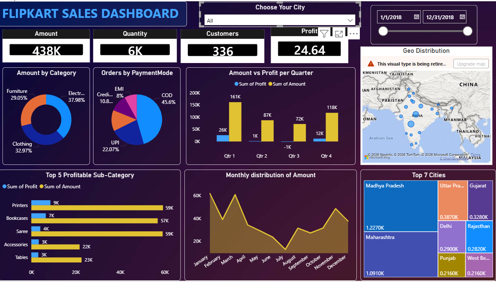

# Flipkart-sales-dashboard
1. Flipkart Sales Dashboard
> Tracking e-commerce sales performance across Indian cities, 
  categories, and quarters using Power BI

2. 📝 Short Description
This dashboard provides a detailed view of Flipkart's 2018 sales data,
enabling analysis of revenue trends, profitable product sub-categories,
regional distribution, and customer payment preferences across India.

3. Tech Stack
- **Power BI Desktop** – Dashboard design & interactive visuals
- **DAX** – Calculated measures and KPIs
- **Microsoft Excel** – Data preparation

4.  Data Source
- 📦 Dataset: [Flipkart Sales Dataset – Kaggle](https://www.kaggle.com/)
- Contains order-level data with fields: Category, Sub-Category,
  Amount, Profit, Quantity, City, State, Payment Mode, Order Date

5.  Features / Highlights
- KPI Cards – Amount (438K), Quantity (6K), Customers (336), Profit (24.64)
- Geo Distribution Map – State-wise sales spread across India
- Amount vs Profit per Quarter – Q1–Q4 comparison (2018)
- Payment Mode Breakdown – COD (45.6%), UPI (22.07%), EMI, Credit
- Top 5 Profitable Sub-Categories – Printers, Bookcases, Saree, Accessories, Tables
- Monthly Amount Distribution – Seasonal trend Jan–Dec
- Top 7 Cities Treemap – Madhya Pradesh, Maharashtra, Delhi & more
- City Filter + Date Slicer – Dynamic filtering by city and date range

  6. Screenshots
     https://github.com/msupritha22/Flipkart-sales-dashboard/blob/main/FILPKART.png

---

